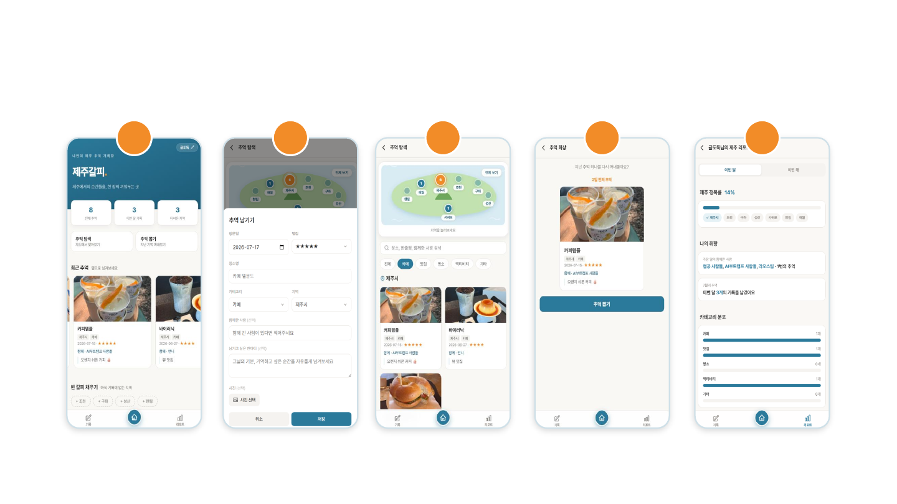

# 제주갈피.

> 책에 책갈피를 꽂아두듯, 제주에서의 순간들을 한 장씩 끼워두는 나만의 제주 추억 기록장

**Live Demo** : https://heiyeong.github.io/jeju-galpi/



<br>

## 소개

제주를 자주 오거나 제주에 거주하며, 일상을 여행처럼 즐기고 기록을 남기고 싶은 사람들을 위한 개인화된 추억 아카이빙 웹앱

- **기록하는 것들** : 다녀온 장소 · 카테고리 · 함께한 사람 · 그날의 한마디 · 사진
- **기억 아카이빙** : "그때 누구랑 어디를 갔었지?" 기억이 흐릿할 때 언제든 쉽게 찾아보고 회상할 수 있음
- 별도의 회원가입 없이 **별명 하나**로 시작

<br>

## 주요 기능

별명으로 시작 → 홈에서 한눈에 보고, 추억을 남기고, 탐색/회상하고, 리포트로 돌아보는 흐름으로 구성

| 화면 | 설명 |
| --- | --- |
| 홈 | 내 기록과 최근 추억을 한눈에 보기 |
| 기록 | 장소 · 사진 · 한마디와 함께 추억 남기기 |
| 탐색 · 지도 | 지도에서 지역별로 추억 찾아보기 |
| 회상 | 지난 추억을 랜덤으로 꺼내보기 |
| 리포트 | 제주 정복률과 나의 취향 분석 |

### 기록 항목

- **방문일 · 별점 · 장소명 · 카테고리**(카페 · 맛집 · 명소 · 액티비티 · 기타) **· 지역**(제주시 · 애월 · 한림 · 서귀포 · 성산 · 조천 · 구좌) **· 동행자 · 한줄평 · 사진**

<br>

## 기술 스택

- **Frontend** : HTML / CSS / Vanilla JavaScript (별도 프레임워크·빌드 도구 없이 단일 페이지로 구성)
- **Backend / DB** : Google Sheets — 별도 서버 없이 스프레드시트를 DB처럼 사용하며, Google Apps Script를 통해 기록 조회·저장·수정·삭제를 시트에 연결
- **아이콘** : Heroicons (SVG) — 화면 크기에 관계없이 선명하게 표시
- **폰트** : Pretendard — 한글 최적화 웹폰트로 가독성 확보
- **컬러** : 제주 바다색과 감귤색을 포인트로 한 브랜드 컬러 팔레트

<br>

## 프로젝트 구조

```
├─ index.html                 # 앱 본체 (홈 · 기록 · 탐색 · 회상 · 리포트)
├─ favicon.png                # 파비콘
├─ og-image.png               # 카카오톡/SNS 링크 미리보기 이미지
└─ presentation/              # 발표자료 (HTML 슬라이드)
```

<br>

## 로컬에서 실행하기

빌드 과정이 없는 정적 페이지이므로 `index.html`을 바로 브라우저로 열거나, 정적 파일 서버로 띄우면 됨

```bash
npx serve .
```

데이터 연동을 확인하려면 `index.html` 상단의 `API_URL`을 자신의 Google Apps Script 배포 URL로 교체 필요

<br>

## 발표자료

- [발표자료 보기 (HTML 슬라이드)](https://heiyeong.github.io/jeju-galpi/presentation/pre.html) — ← → 방향키로 넘겨보기
